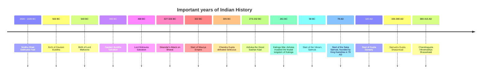

```mermaid
timeline
    title Important years of Indian History
    2500 - 1500 BC : Sindhu Ghati Sabhyata Kaal
    563 BC : Birth of Gautam Buddha
    540 BC : Birth of Lord Mahavira
    483 BC : Gautam Buddha Salvation
    468 BC : Lord Mahavira Salvation
    327-326 BC : Sikandar's Attack on Bharat
    322 BC : Start of Maurya Empire
    305 BC : Chandra Gupta defeated Seleucus
    273-232 BC : Ashoka the Great Sashan Kaal
    261 BC : Kalinga War, Ashoka invaded the feudal kingdom of Kalinga
    58 BC : Start of the Vikram Samvat
    78 AD : Start of the Saka Samvat, founded by King Kanishka in 78 AD
    320 AD : Start of Gupta Dynasty
    335-380 AD : Samudra Gupta Shasankaal
    380-415 AD : Chandragupta Vikramaditya Shasankaal
    
 
```
