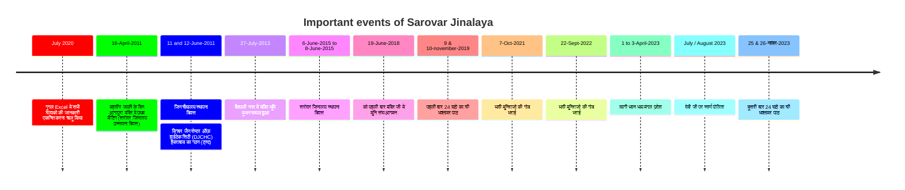

```mermaid
%%{init: { 'logLevel': 'debug', 'theme': 'default' , 'themeVariables': {
          'cScale0': '#ff0000', 'cScaleLabel0': '#ffffff',
          'cScale1': '#00ff00',
          'cScale2': '#0000ff', 'cScaleLabel2': '#ffffff'
   } } }%%
timeline
    title Important events of Sarovar Jinalaya
    July 2020 : गूगल Excel में सभी श्रावकों की जानकारी एकत्रित करना चालू किया
    16-April-2011 : महावीर जयंती के दिन आगापुरा मंदिर में प्रथम मीटिंग (सरोवर जिनालय प्रस्तावना दिवस)
    11 and 12-June-2011 :  जिन चैत्यालय स्थापना दिवस : दिगंबर जैन सेण्टर ऑफ़ हाईटेक सिटी (DJCHC) हैदराबाद का गठन (ट्रस्ट)
    27-July-2013 : वैशाली नगर में मंदिर भूमि पूजन सम्पन्न हुआ
    6-June-2015 to 8-June-2015 : सरोवर जिनालय स्थापना दिवस
    19-June-2018 : को पहली बार मंदिर जी में मुनि संघ आगमन
    9 & 10-november-2019 : पहली बार 24 घंटों का श्री भक्तामर पाठ
    7-Oct-2021 : भावी मुनिराजों की गोद भराई
    22-Sept-2022 : भावी मुनिराजों की गोद भराई
    1 to 3-April-2023 : त्यागी भवन भव्य मंगल प्रवेश
    July / August 2023 : वेदी जी पर स्वर्ण पोलिश
    25 & 26-नवंबर-2023 : दूसरी बार 24 घंटों का श्री भक्तामर पाठ
```

